# DevOps Interview Assignment

This repository contains the documentation and implementation details for the ECW DevOps interview assignment tasks.

## Task 1: Gradle Project - Calculator

### Repository URL
https://github.com/anujsahatpure/ecw_calculator_task.git

### Implementation Details
- Created a custom Gradle task for a calculator application
- Supports basic operations: addition, subtraction, multiplication, and division
- Takes numbers and operation as parameters from user
- Example usage:
```bash
gradle calculatorTask -Pnum1=8 -Pnum2=9 -Poperator=+
```

### Screenshots
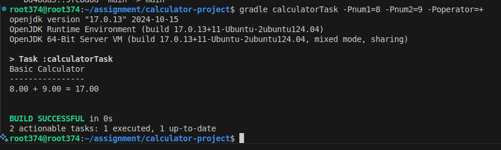

## Task 2: Python Application

### Repository URL
https://github.com/anujsahatpure/ecw_python_task.git

### Implementation Details
A Flask-based Todo List application with the following features:
- Add new tasks
- Mark tasks as complete
- Remove tasks from the list
- Simple and intuitive web interface
- Built using Flask framework

### Screenshots
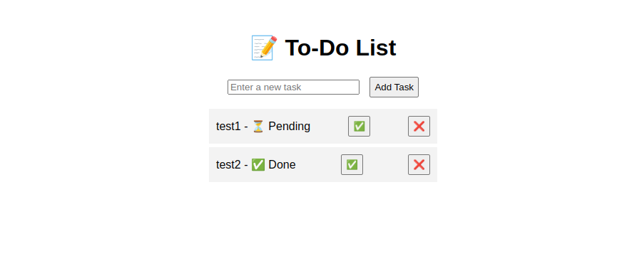

## Task 3: Cron Job Implementation

### Cron Job Script
```bash
# Cron job scheduled for 3 PM daily
0 15 * * * /path/to/script.sh
```

### Script Implementation
```bash
#!/bin/bash
#Create directory if not exists
mkdir -p "$HOME/git_logs"

# Set output file
cd /tmp

# Clone repository
git clone https://github.com/anujsahatpure/ecw_calculator_task.git
cd ecw_calculator_task || exit

# Get git log with specific format and last 5 commits
git log -n 5 --pretty=format:"Author: %an%nFiles Changed:%n" --name-only > "$HOME/git_logs/gitlog_$(date +%d%m%Y).log"

# Clean up - remove repository
cd ..
rm -rf ecw_calculator_task
```

### Screenshots
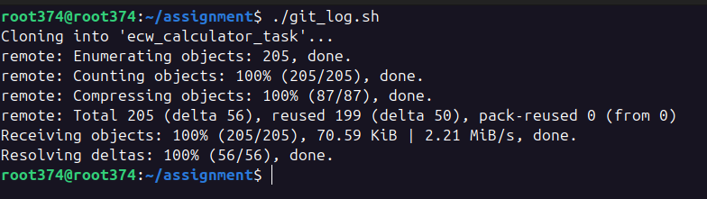
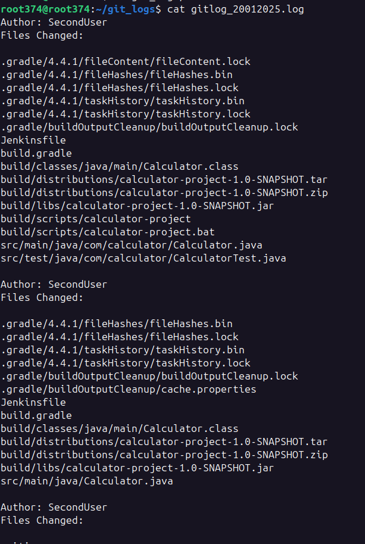

## Task 4: CI/CD Pipeline Setup

### Jenkins Setup
- Jenkins URL: http://localhost:8080
- Build Schedule: Daily at 10 AM

### SonarQube Setup
- SonarQube URL: http://localhost:9000

### Pipeline Configuration
#### Gradle Project Pipeline
```groovy
pipeline {
    agent any
    environment {
        SONARQUBE = 'localsonarserver'
        SONAR_TOKEN = credentials('SONAR_TOKEN')
    }
    stages {
        stage('Checkout') {
            steps {
                git branch: "main", url: 'https://github.com/anujsahatpure/ecw_calculator_task.git'
            }
        }
        stage('Build') {
            steps {
                sh 'gradle clean build'
            }
        }
        stage('SonarQube Analysis') {
            steps {
                script {
                    withSonarQubeEnv('localsonarserver') {
                        sh '''
                            gradle sonarqube \
                                -Dsonar.projectKey=Java-Calculator-Task \
                                -Dsonar.java.source=17 \
                                -Dsonar.java.target=17 \
                                -Dsonar.sources=src/main/java \
                                -Dsonar.tests=src/test/java \
                                -Dsonar.java.binaries=build/classes/java/main \
                                -Dsonar.coverage.exclusions=**/test/** \
                                -Dsonar.token=$SONAR_TOKEN
                        '''
                    }
                }
            }
        }
        stage('Run Calculator Test') {
            steps {
                sh '''
                    gradle calculatorTask \
                        -Pnum1=10 \
                        -Pnum2=5 \
                        -Poperator=+
                '''
            }
        }
        stage('Upload Build Artifacts') {
            steps {
                archiveArtifacts artifacts: 'build/libs/*.jar', allowEmptyArchive: true
            }
        }
        stage('Cleanup') {
            steps {
                cleanWs()
            }
        }
    }
    post {
        success {
            echo 'Build succeeded!'
        }
        failure {
            echo 'Build failed!'
        }
    }
}

```

#### Python/Java Project Pipeline
```groovy
pipeline {
    agent any
    environment {
        SONAR_SCANNER_HOME = '/opt/sonar-scanner'
        SONARQUBE_TOKEN = credentials('SONAR_TOKEN_PYTHON')
    }
    stages {
        stage('Checkout') {
            steps {
                git branch: "main", url: 'https://github.com/anujsahatpure/ecw_python_task.git'
            }
        }
        stage('Setup Environment') {
            steps {
                script {
                    sh 'python3 -m venv venv'
                    sh '. venv/bin/activate && pip install -r requirements.txt'
                }
            }
        }
        stage('Run Tests with Coverage') {
            steps {
                script {
                    // Run tests with coverage reporting
                    sh '''
                        . venv/bin/activate
                        pytest --cov=app --cov-report=xml:coverage.xml --cov-report=html:coverage_html --junitxml=report.xml test_app.py
                    '''
                }
            }
        }
        stage('SonarQube Scan') {
            steps {
                script {
                    sh '''
                        $SONAR_SCANNER_HOME/bin/sonar-scanner \
                        -Dsonar.projectKey=ecw_python_project \
                        -Dsonar.sources=. \
                        -Dsonar.host.url=http://localhost:9000 \
                        -Dsonar.python.coverage.reportPaths=coverage.xml \
                        -Dsonar.token=$SONARQUBE_TOKEN
                    '''
                }
            }
        }
        stage('Build') {
            steps {
                echo "Build stage complete"
            }
        }
        stage('Upload Artifacts') {
            steps {
                archiveArtifacts artifacts: 'coverage.xml, report.xml, coverage_html/**', allowEmptyArchive: true
            }
        }
        stage('Cleanup') {
            steps {
                cleanWs()
            }
        }
    }
    post {
        always {
            junit allowEmptyResults: true, testResults: 'report.xml'
        }
        success {
            echo 'Pipeline completed successfully!'
        }
        failure {
            echo 'Pipeline failed! Check logs for errors.'
        }
    }
}

```

### Screenshots
#### Jenkins Build Pipeline
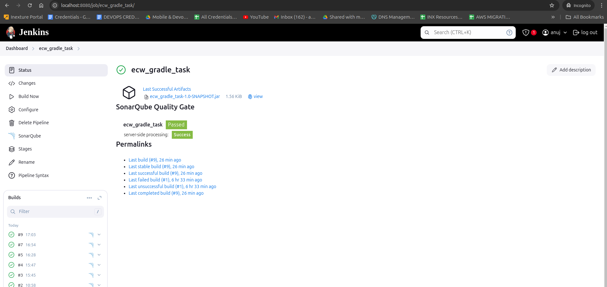
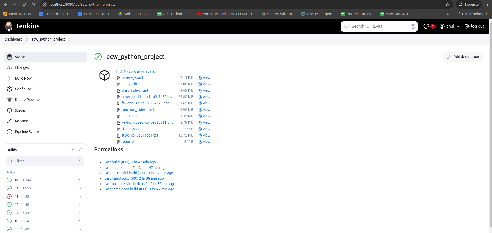
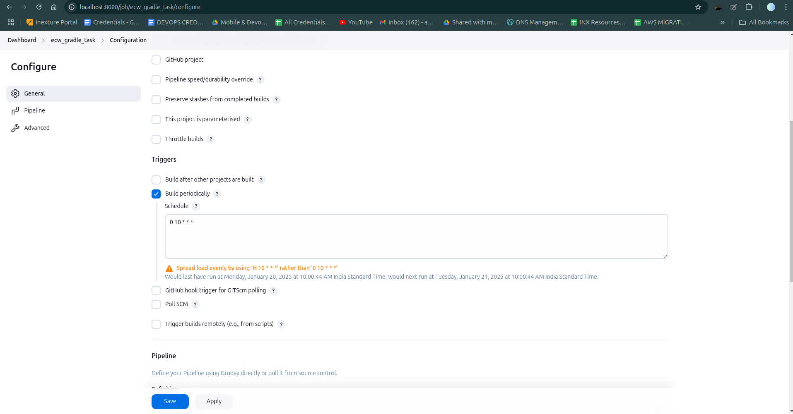
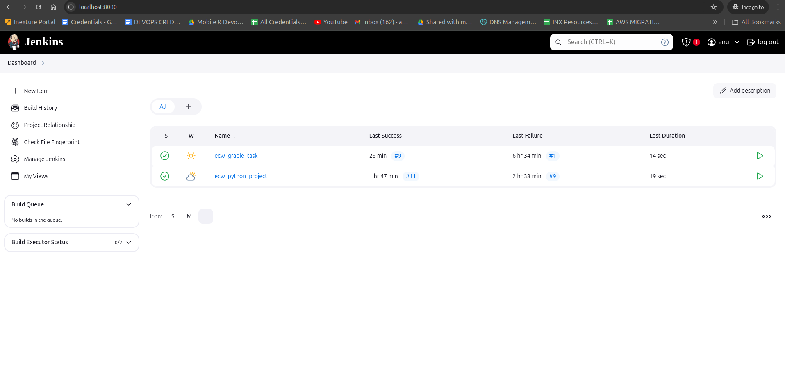

#### SonarQube Analysis
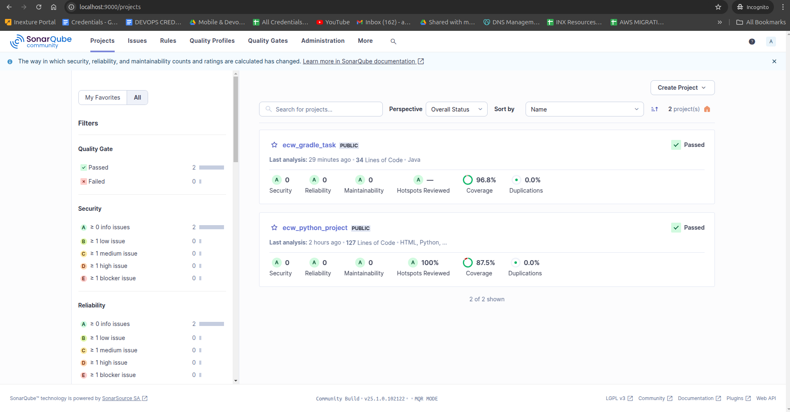
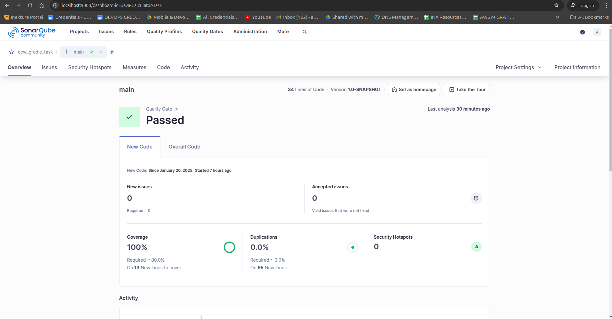
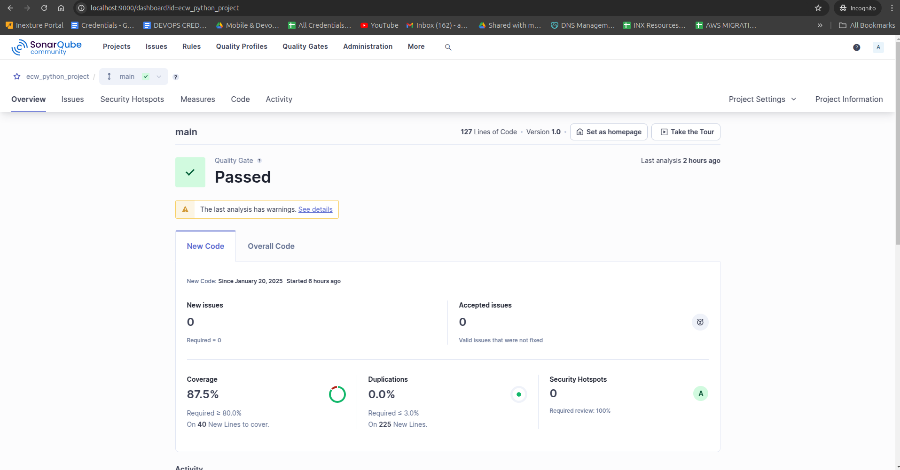

## Git Users and Commits

### PrimaryUser
- Name: Anuj Sahatpure
- Email: anujsahatpure16@gmail.com

### Git Different Users and Configurations
```bash
git config user.name "User"
git config user.email "user@example.com"
```

### User 1
- Name: SecondUser
- Email: seconduser@example.com

### User 2
- Name: ThirdUser
- Email: thirduser@example.com

## Additional Notes
- All source code is available in the respective GitHub repositories
- Pipeline configurations are included in the repositories
- Screenshots demonstrate successful implementation of all requirements
